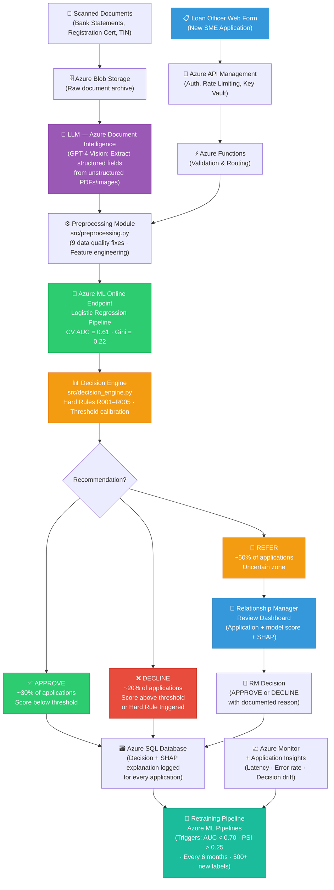

<!-- 
  Stanbic Bank Ghana — SME Credit Assessment Pipeline
  Architecture Diagram (Mermaid format)
  
  To render: paste the code block below into https://mermaid.live
  Export as PNG at 2x resolution for the presentation deck.
-->

## Key Design Decisions (for the diagram explanation)

| Component | Why it exists |
|-----------|--------------|
| LLM (Document Intelligence) | Extracts structured fields from scanned docs. Does NOT make credit decisions — it is a data extraction tool only. |
| Hard Rules (R001–R005) | Fire before the model. Categorical policy answers (e.g., 60+ DPD) that no probability changes. |
| Three-zone decision | No bank auto-decides every case. REFER zone explicitly handles uncertainty — humans review those. |
| SHAP on every DECLINE | Regulatory requirement. Every adverse decision must be explainable. |
| RM feedback → Retraining | Closes the loop. Human decisions become labeled training data for future model versions. |
| Azure ML Pipelines | Automated train → evaluate → register → deploy. Human approves before production swap. |

## Retraining Triggers

| Trigger | Threshold | Reason |
|---------|-----------|--------|
| Performance degradation | AUC on labeled batch < 0.70 | Model no longer discriminating |
| Data drift | PSI > 0.25 on key features | Input distribution shifted from training |
| Time-based | Every 6 months | Macroeconomic conditions change |
| Volume-based | 500+ new labeled samples | Enough fresh ground truth to retrain |
